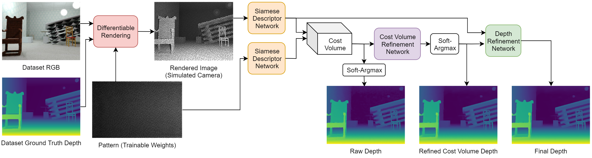
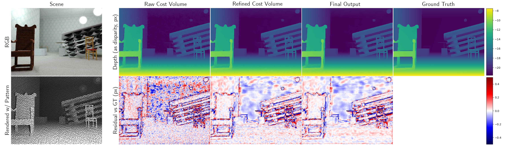

# Self-Supervised Joint Learning of Patterns and Matching for Structured Light Depth Estimation
This is a machine-learning method for single-shot structured-light depth estimation, where the projected pattern is jointly optimized alongside weights in the depth-matching network.  

This is done by:
1) Simulating pattern projection onto a ground-truth dataset, via an in-network differentiable renderer
2) Passing this rendered camera image + the pattern to a depth-matching network
3) Applying losses that compare the output of the matching network to the ground-truth depth used for rendering; multiple losses are connected at various stages in the network to accelerate training
4) Treating the projected pattern as trainable weights, and training it alongside the depth matching network.  

The result is a single projected pattern and depth-matching network which are uniquely suited for each other.  Testing on held-out data yields ~1/30-pixel RMSE on uniform slanted planes, and ~0.2px RMSE on rendered scenes with a variety of content.

  

## Quick Start
1) Download the SceneNet-RGBD training and validation sets from here: https://robotvault.bitbucket.io/scenenet-rgbd.html (total ~278 GB)
2) Edit `config.py` to specify paths to training, validation, and (optional) test/visualization sets
3) Run `train.py`
4) Once trained, see `eval.py` for computing metrics and visualizing output.  

## Dependencies
Python 3:
- TensorFlow 2.0.0
- NumPy
- OpenCV
- matplotlib
